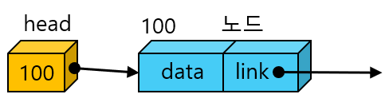
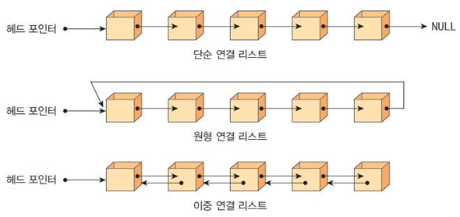

# Linked List

## 정의

* 연결리스트란? 흩어져 있는 쟈료들을 서로 연결하여 묶는 방법, 연결하는 줄은 포인터가 된다.  

<p align="center">
    
</p>

* Ex : A, B, C, D는 메모리 어딘가에 흩어져 있다.
* `A (pointer)-> B (pointer)-> C (pointer)-> D`
* 만일 N을 B와 C 중간에 삽입하게 될 경우, `A (pointer)-> B (change)-> N (new pointer)-> C (pointer)-> D`
* 데이터를 삽입할 경우, 앞(**head**) 노드가 가리키고 있던 포인터를 N을 가리키게끔 변경하고 만일 뒤(**tail**)에 노드가 존재할 경우 새로운 포인터로 노드를 가리킨다.
* 만일 C를 삭제하게 된다면 `A (pointer)-> B (new pointer D)-> D`
* 과정 : `A (pointer)-> B (delete pointer C, new pointer D)-> C (delete pointer D)-> D`

## 연결리스트의 종류

<p align="center">
    
</p>

연결리스트의 종류로는 총 3가지가 존재한다.  

* **단순 연결 리스트(singly linked list) :** 하나의 방향으로만 연결되어 있는 연결 리스트이다. 단순 연결 리스트는 체인(chain)이라고도 한다. **단순 연결 리스트와 마지막 노드의 링크는 항상 NULL 값을 가진다.**
* **원형 연결 리스트(circular linked list) :** 단순 연결 리스트와 같으나 **마지막 노드의 링크가 첫 번째 노드를 가리킨다.**
* **이중 연결 리스트(doubly linked list) :** 각 노드마다 **2개의 링크가 존재**한다. 하나의 링크는 앞에 있는 노드를 가리키고 또 하나의 링크는 뒤에 있는 링크를 가리킨다.

## 단순 연결 리스트

기본적인 단순 연결 리스트는 다음과 같은 함수가 필요합니다.  

```C
// 처음으로 들어갈 노드를 삽입할 때 사용하는 함수
// 1. 동적할당으로 노드를 생성한다
// 2. 매개변수 data에 있는 값으로 새로 만들어진 노드의 data에 저장한다.
// 3. 매개변수 head에 있는 주소를 새로 만들어진 노드의 next에 저장한다.
// 4. newNode의 주소를 head에 저장한다.
// 5. 업데이트된 head의 주소를 반환한다.
Node *insertFirst(Node *head, element data)

// 노드를 삽입할 때 사용하는 함수
// 1. 동적할당으로 노드를 생성한다
// 2. 매개변수 data에 있는 값으로 새로 만들어진 노드의 data에 저장한다.
// 3. 매개변수 head에 있는 주소를 새로 만들어진 노드의 next에 저장한다.
// 4. 매개변수 pre가 가진 next의 주소를 새로 만들어진 노드의 next에 저장한다.
// 5. 매개변수 pre가 가진 next에 새로 만들어진 노드를 저장한다.
// 6. 업데이트된 head의 주소를 반환한다.
Node *insert(Node *head, Node *pre, element data)

// 첫 위치의 노드를 삭제하는 함수
// 1. head의 주소를 가진 변수 removed를 생성한다.
// 2. head에 next의 주소를 저장한다.
// 3. removed(head)가 가리키고 있는 위치의 노드의 동적할당을 해제한다.
// 4. 노드가 있었던 위치에 쓰레기값이 남지 않도록 NULL로 변경한다.
// 5. 업데이트된 head의 주소를 반환한다.
Node *deleteFirst(Node *head)

// 매개변수 pre가 가리키는 다음 노드의 주소를 삭제하는 함수
// 1. pre가 가리키는 next의 주소를 가진 변수 removed를 생성한다.
// 2. pre가 가리키는 next의 주소를 removed의 next로 변경하여
//    pre->next->next의 주소를 가리키게끔 한다.
// 3. removed(pre->next)가 가리키고 있는 위치의 노드의 동적할당을 해제한다.
// 4. 노드가 있었던 위치에 쓰레기값이 남지 않도록 NULL로 변경한다.
// 5. 업데이트된 head의 주소를 반환한다.
Node *delete(Node *head, Node *pre)

// head로부터 연결된 모든 노드를 출력하는 함수
void printList(Node *head)
```
