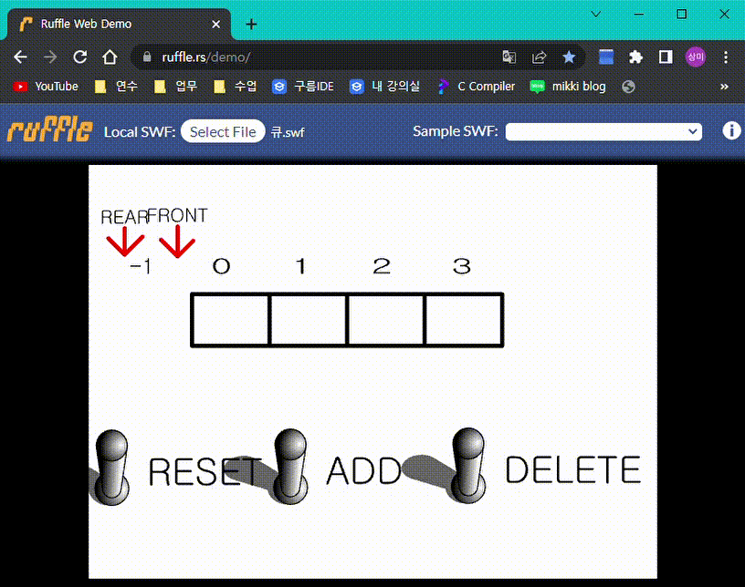
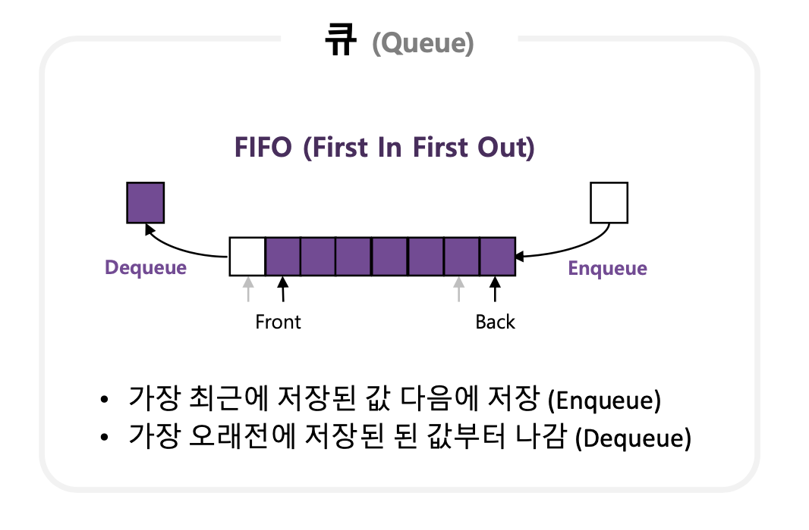
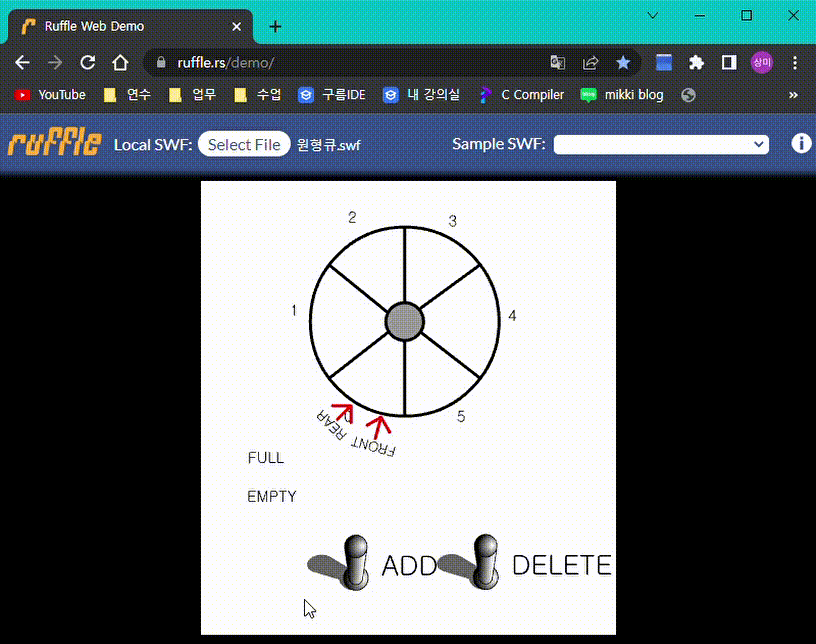

# Data Structure - Queue

## **선형 Queue**

* **선형 Queue**는 **`선입선출(FIFO, First in first out)`** 방식의 자료구조

* [눈으로 선형 Queue를 확인해보기(head = front, Tail = rear)](https://www.cs.usfca.edu/~galles/visualization/QueueArray.html)

<p align="center"></p><br>

### **선형 Queue의 원리**

<br>
<p align="center"></p>

* **front:** 삭제 할 위치를 가리킨다.
  * ex) dequeue() 함수를 실행하면 front의 값이 올라가며 가리키는 위치가 변경된다.

* **rear(back):** 삽입 할 위치를 가리킨다.
  * ex) queue() 함수를 실행하면 rear(back)의 값이 올라가며 가리키는 위치가 변경된다.

* 선형 Queue의 **`size`** 가 가득 찰 경우 **`full 상태`** 가 된다.

* 선형 Queue의 **`front`** 와 **`rear`** 가 가리키는 위치가 같을 경우, 다음 두 가지 중 하나에 포함된다는 의미이다.
  * Queue의 **초기상태**
  * Queue에 **저장된 자료가 없음(`empty 상태`)**

### **선형 Queue - Source code**

```c
#include <stdio.h>
#include <stdlib.h>
#define MAX_Q_SIZE 5
typedef int element;

// 선형 Queue의 기본구조

//Queue 구조체 정의
typedef struct {
	int front;
	int rear;
	element data[MAX_Q_SIZE];
} Queue;

void error(char *message)
{
	printf("%s\n", message);
	exit(0); //메인함수 종료
}

void initQueue(Queue *q)
{
	q->front = q->rear = -1;
}

int isFull(Queue *q)
{
	return q->rear == MAX_Q_SIZE - 1;
}

int isEmpty(Queue *q)
{
	return q->front == q->rear;
}

void enQueue(Queue *q, element item)
{
	if (isFull(q))
		error("Queue is full");
	q->rear++; // rear가 가리키는 위치를 다음 위치로 이동
	q->data[q->rear] = item; // data[rear]에 item을 저장
}

element deQueue(Queue *q)
{
	if (isEmpty(q))
		error("Queue is empty");

	q->front++; // front가 가리키는 위치를 다음 위치로 이동
	return q->data[q->front]; // data[front]를 반환
}

void queuePrint(Queue *q)
{
	int i;
	for (i = 0; i < MAX_Q_SIZE; i++) {
		if (i <= q->front || i > q->rear) {
			printf(" | ");
		} else {
			printf("%d | ", q->data[i]);
		}
	}
	printf("\n");
}
int main()
{
	element item = 0;
	Queue q;

	initQueue(&q);
	enQueue(&q, 10);
	queuePrint(&q);
	enQueue(&q, 20);
	queuePrint(&q);
	enQueue(&q, 30);
	queuePrint(&q);
	item = deQueue(&q);
	queuePrint(&q);
	item = deQueue(&q);
	queuePrint(&q);

  return 0;
}
```

### **동적할당을 사용한 선형 Queue - Source code**

```c
#include <stdio.h>
#include <stdlib.h>

typedef int element;
typedef struct {
	element *data;
	int front;
	int rear;
	int size;
} Queue;

Queue *initQueue(int n);
int isFull(Queue *q);
void enQueue(Queue *q, element data);
int isEmpty(Queue *q);
element deQueue(Queue *q);
void destroyQueue(Queue *q);
void printAll(Queue *q);

int main()
{
	Queue *q;
	element data;
	q = initQueue(5); // Queue 초기화
	enQueue(q, 10);
	printAll(q);
	enQueue(q, 20);
	printAll(q);
	enQueue(q, 30);
	printAll(q);
	enQueue(q, 40);
	printAll(q);
	enQueue(q, 50);
	printAll(q);
	data = deQueue(q);
	printAll(q);
	enQueue(q, 60);
	printAll(q);
	destroyQueue(q);
	return 0;
}

Queue *initQueue(int n)
{
	Queue *temp = (Queue *)malloc(sizeof(Queue));
	temp->size = n; // n을 크기로 하는 큐
	temp->rear = temp->front = -1;
	// 크기 n 을 가지는 동적 배열 생성
	temp->data = (element *)malloc(sizeof(element) * 5);

	return temp;
}

int isFull(Queue *q)
{
	// 큐가 가득 차 있다면 rear 은 어떤 상태일까?
	return q->rear == q->size - 1;
}

void enQueue(Queue *q, element data)
{
	// 가득 차 있다면 "Queue is full"이라고 출력
	// 아니면 rear에 data 삽입
	if (isFull(q))
		printf("Queue is full\n");
	else {
		q->rear++;
		q->data[q->rear] =
			data; // 동적할당을 해둔 영역을 배열처럼 사용할 수 있음
	}
}

int isEmpty(Queue *q)
{
	// 큐가 비어 있따면 rear과 front 는 어떤 상태일까?
	return q->rear == q->front;
}

element deQueue(Queue *q)
{
	// 비어 있다면 "Queue is empty" 출력하고 0 리턴
	// 아니면 front위치의 데이터 리턴
	if (isEmpty(q)) {
		printf("Queue is empty\n");
		return 0;
	} else {
		q->front++;
		return q->data[q->front];
	}
}

void printAll(Queue *q)
{
	int i;
	for (i = 0; i < q->size; i++) {
		if (i <= q->front || i > q->rear) {
			printf(" | ");
		} else {
			printf("%d | ", q->data[i]);
		}
	}
	printf("\n");
}

void destroyQueue(Queue *q)
{
	// data 동적 메모리 해제
	// q 동적 메모리 해제
	free(q->data);
	free(q);
}
```

## **원형 Queue**

* 선형 Queue의 문제점은 front가 이전 위치로는 돌아갈 수 없어, 지워진 위치가 비더라도 자료를 추가할 수 없다.  
→ **원형 Queue**를 이용하여 이를 해결할 수 있다.  

<p align="center"></p>

* 기본적인 Queue의 처음과 끝을 논리적으로 연결하여 오버플로 발생을 보완하였다.

* 초기상태는 front = rear = 0, 초기 Queue size를 n이라고 둔다.

* 입력(queue) / 삭제(dequeue)

  * 자료 입력을 할 시: rear 값에 (rear + 1) % n을 더한다.

  * 자료를 삭제할 시: front 값에 (front + 1) % n을 더한다.

  * (rear + 1) 또는 (front + 1)에 Queue size의 나머지를 구하게 되면 rear의 값이 초과하는 경우가 발생해도 Queue size 값 내에서 rear의 값이 결정된다.

  * ex) **`rear`** 또는 **`front`** 가 **16** 일 때, `삽입 / 삭제`를 하게 되면 위치는 **`(16 + 1) % 5`** 이므로 **2**가 된다.

* 원형 Queue의 문제는 **`Full`** 상태와 **`Empty`** 상태일 때 front와 rear의 값이 같으므로 Full과 Empty 상태를 구분하지 못한다.  
→ 이를 해결하기 위해 front와 rear 사이에 하나의 공백을 둔다.  

### **원형 Queue - Source code**

```c
#include <stdlib.h>
#include <stdio.h>

/*
  선형 Queue의 문제점: Queue의 앞 부분이 비더라도 자료를 추가할 수 없으므로 메모리 낭비가 생긴다.
  --> 이를 원형 Queue를 이용하여 해결할 수 있다.

  원형 Queue의 원리 :
 
  초기 상태는 front, rear의 값이 0이고, 최대 Queue size는 MAX_Q_SIZE(n)로 정의한다.

  enqueue() 호출 시 rear 값에 (rear + 1) % n을 더한다.
  dequeue() 호출 시 front 값에 (front + 1) % n을 더한다.

  원형 Queue의 문제로는 full 상태와 empty 상태일 때 front와 rear 값이 같은 문제점이 발생한다.
  ==> 이를 해결하기 위해 front와 rear 사이에 하나의 공백을 두었다.
*/

#define MAX_Q_SIZE 5

typedef int element;
typedef struct {
	int rear;
	int front;
	element data[MAX_Q_SIZE];
} Queue;

void initQueue(Queue *q)
{
	//front, rear 초기화
	q->front = q->rear = 0;
}

int isEmpty(Queue *q)
{
	// front가 가리키는 위치와 rear가 가리키는 위치가 같을 경우
	return q->front == q->rear;
}

int isFull(Queue *q)
{
	// rear의 다음 위치(rear + 1)의 값이 front와 같을 경우
	return (q->rear + 1) % MAX_Q_SIZE == q->front;
}

void enQueue(Queue *q, element item)
{
	// Queue를 추가하기 전에 Queue가 가득 찼는지 검사를 진행합니다.
	if (isFull(q))
		printf("큐가 포화상태입니다.\n");
	else {
		q->rear++;
		q->data[q->rear % MAX_Q_SIZE] = item;
	}
}
element deQueue(Queue *q)
{
	// Queue를 제거하기 전에 Queue가 비었는지 검사를 진행합니다.
	if (isEmpty(q))
		printf("큐는 공백상태입니다.\n");
	else {
		q->front++;
		return q->data[q->front % MAX_Q_SIZE];
	}
}
void printQueue(Queue *q)
{
	int i;

	printf("QUEUE(front=%d rear=%d) = ", q->front, q->rear);

	if (isEmpty(q)) {
		printf("큐는 공백상태입니다.\n");

		return;
	}

	i = q->front;

	do {
		i = (i + 1) % (MAX_Q_SIZE);

		printf("%d | ", q->data[i]);

		if (i == q->rear)
			break;
	} while (i != q->front);

	printf("\n");
}

int main()
{
	Queue q;
	element item;

	initQueue(&q);

	printf("--데이터 추가 단계--\n");

	while (!isFull(&q)) {
		printf("정수를 입력하시오.");
		scanf("%d", &item);
		enQueue(&q, item);
		printQueue(&q);
	}

	printf("큐는 포화상태입니다.\n\n");
	printf("--데이터 삭제 단계--\n");

	while (!isEmpty(&q)) {
		item = deQueue(&q);
		printf("꺼내진 정수 : %d\n", item);
		printQueue(&q);
	}

	printf("큐는 공백상태입니다.\n\n");

	return 0;
}

```
