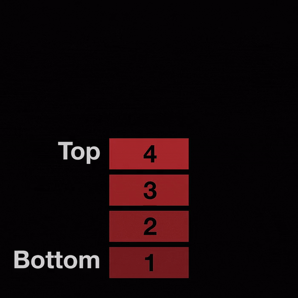

# Data Structure - Stack

## **Stack의 개념**

<p align="center"></p>

* **스택(Stack)**: 모든 자료의 삽입과 삭제가 한쪽의 끝에서만 수행되는 제한적 개념의 선형구조

* **LIFO(Last In First Out)**: 후입선출(선입후출) 구조

* **Top pointer**: 스택의 **`가장 위에 위치하는 자료`** 를 가리키며, 동시에 **`삭제할 지점을 가리키는 역할`** 도 한다.

### **Stack의 오류조건**

* **오버플로(Overflow)**: 스택의 크기보다 더 많은 값이 들어올 경우 생기는 오류
  * ex) MAX_STACK_SIZE가 5인데 그보다 더 많은 값이 들어올 경우 오류를 출력한다.

* **언더플로(Underflow)**: 스택에 현재 아무것도 저장되어 있지 않은데(공백상태) pop()을 사용하려고 하는 경우

### **구조체를 이용한 Stack 구현 - Source code**

```c
#include <stdio.h>
#include <stdlib.h>

#define STACK_SIZE 10
typedef int element;

//Stack 구조체 구현
typedef struct {
  element data[STACK_SIZE];
  int top;
}Stack;

int isFull( Stack *s );
int isEmpty( Stack *s );
void push( Stack *s, element data );
int pop( Stack *s );
void initStack(Stack* s );

int main() 
{
  int menu;
  element data ;
  Stack s;

  initStack(&s);

  do{
    printf("1:push, 2:pop, 0:exit : ");
    scanf("%d", &menu);
    switch( menu ) {
      case 1 :
        printf("데이터 입력 : ");
        //입력 
        scanf("%d", &data);
        //스택에 입력
        push(&s, data);
      break;

      case 2 :
        data = pop(&s); //스택에서 출력
        if( data )
        printf("pop 데이터 : %d\n", data);
      break;
      
      case 0 :
      break;
    
      default :
        printf("잘못된 입력 입니다. \n");
      break;
    }
  }while( menu );

  return 0;
}

void initStack( Stack *s ){  // top 포인터를 -1로 초기화
  s->top = -1;
}

int isFull( Stack *s ){   // 스택이 가득 차 있으면 true 리턴
  return s-> top == STACK_SIZE - 1;
}

int isEmpty( Stack *s ){   // 스택이 비어 있으면 true 리턴
  return s-> top == -1;
}

void push( Stack *s, element data ){ //스택이 가득 차 있으면 문구 출력 후 리턴, 아니면 push
  if(isFull(s)) {
    printf("Stack is full\n");
    exit(0);
  }
  s-> top++;
  s-> data[s->top] = data;
}

element pop( Stack *s ){  //스택이 비어  있으면 문구 출력 후 0 리턴, 아니면 맨 위 데이터 리턴
  if(isEmpty(s)) {
    printf("Stack is empty\n");
    exit(0);
  }

  return s-> data[s-> top--];
}
```
